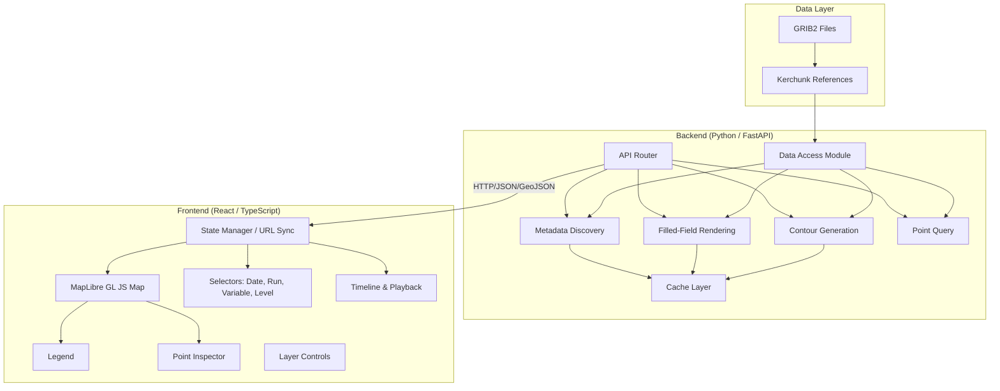
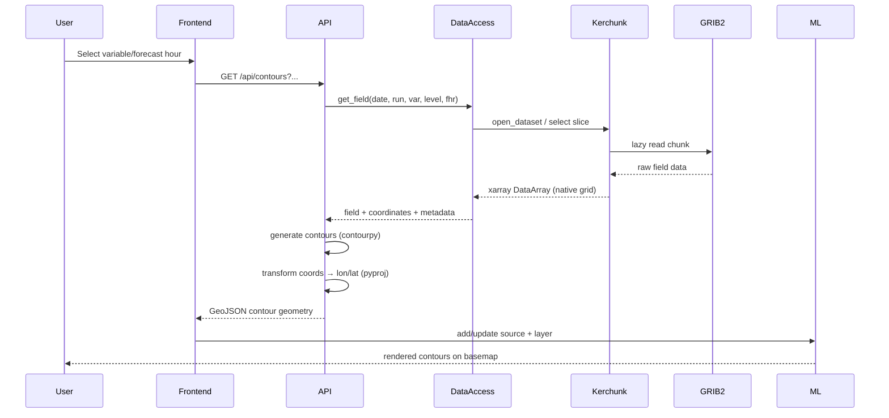
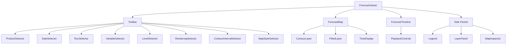
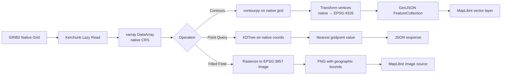
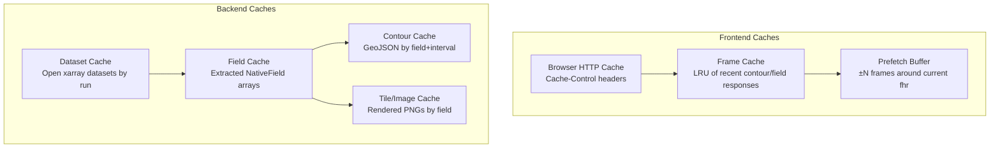

# Air Composition Forecast Viewer — Technical Design

## Overview

The Air Composition Forecast Viewer is a desktop-first web application for visualizing gridded air-composition forecast output stored in GRIB2 format. It consists of a Python/FastAPI backend that reads GRIB2 data via the existing Kerchunk implementation, performs scientific processing on native model grids, generates contours and field renderings, and exposes RESTful APIs. A React/TypeScript/MapLibre GL JS frontend consumes these APIs to present an operational forecasting workstation experience.

The system enforces a strict boundary: scientific data remains in native model projection for all computations; EPSG:3857 (Web Mercator) is used only at the presentation layer for MapLibre display.

**Key design drivers:**
- Reuse existing Kerchunk backend code (no rewrite)
- Metadata-driven variable/rendering configuration (no hardcoded species)
- Desktop-optimized with persistent controls and large map area
- Extensible to future Meteorology domain without architectural changes

---

## Architecture

### High-Level System Diagram



### Request Flow



---

## Components and Interfaces

### Backend Modules

| Module | Responsibility | Key Dependencies |
|--------|---------------|------------------|
| `app.data.access` | Open datasets via Kerchunk, select fields by coordinates | xarray, kerchunk, fsspec, zarr |
| `app.data.metadata` | Discover dates, runs, variables, levels, forecast hours | xarray, cf-xarray |
| `app.data.config` | Domain/variable rendering configuration (YAML-driven) | pydantic |
| `app.contours.generator` | Generate isolines from native-grid fields | contourpy |
| `app.contours.transform` | Transform contour vertices from model grid to lon/lat | pyproj |
| `app.contours.serialize` | Convert contour geometry to GeoJSON | shapely, orjson |
| `app.rendering.field` | Generate filled-field PNG overlays or tile images | matplotlib, rasterio, numpy |
| `app.point_query.service` | Nearest-gridpoint lookup, value extraction | scipy (KDTree), numpy |
| `app.cache.manager` | In-memory LRU caches for datasets, fields, contours, tiles | cachetools |
| `app.api.routes` | FastAPI router: metadata, contours, field, point, health | fastapi, pydantic |
| `app.projection.pipeline` | Coordinate transforms between native grid and EPSG:4326 | pyproj, affine |
| `app.instrumentation` | Structured timing logs for all pipeline stages | structlog |

### Frontend Components

| Component | Responsibility |
|-----------|---------------|
| `ForecastViewer` | Root layout: toolbar, map, timeline, sidebars |
| `ForecastMap` | MapLibre instance, layer management, click handling |
| `ContourLayer` | Manages GeoJSON source/layer for isolines |
| `FilledLayer` | Manages raster/image source for filled contours |
| `ProductSelector` | Top-level domain selector (Air Composition / future Meteorology) |
| `DateSelector` | Date picker with available-date constraint |
| `RunSelector` | Initialization run chooser (00Z, 06Z, etc.) |
| `VariableSelector` | Grouped variable selector, metadata-driven |
| `LevelSelector` | Vertical level chooser (conditionally visible) |
| `RenderingSelector` | Mode: Filled + Contours / Contours / Filled |
| `ContourIntervalSelector` | Adjust contour interval |
| `ForecastTimeline` | Slider + step buttons for forecast hours |
| `PlaybackControls` | Play/Pause/First/Last with prefetch logic |
| `Legend` | Color bar + range labels, synced to variable config |
| `MapInspector` | Point-click value display panel |
| `LayerPanel` | Toggle geographic overlays |
| `MapStyleSelector` | Dark/Light style toggle |
| `TimeDisplay` | Init time, forecast hour, valid time readout |

### Component Hierarchy



---

## Data Models

### Backend Models (Pydantic)

```python
from pydantic import BaseModel
from datetime import datetime
from typing import Optional

# --- Metadata models ---


class CatalogEntry(BaseModel):
    product: str  # e.g. "air"
    description: str


class AvailableDate(BaseModel):
    date: str  # ISO date "2026-08-19"
    runs: list[str]  # ["00", "06", "12", "18"]


class VariableInfo(BaseModel):
    id: str  # e.g. "PM25"
    label: str  # e.g. "PM2.5"
    category: str  # e.g. "Particulate Matter"
    units: str  # e.g. "ug m-3"
    levels: list[str]  # e.g. ["surface"] or ["1000", "925", "850", ...]
    rendering: "RenderingConfig"


class RenderingConfig(BaseModel):
    default_mode: str  # "both" | "contours" | "filled"
    contour_interval: float
    major_contour_interval: float
    labels: bool
    color_scale: str  # reference to color scale name
    fill_levels: list[float]  # bin boundaries for filled contours
    decimals: int  # display precision


class ForecastTimeInfo(BaseModel):
    forecast_hours: list[int]  # [0, 1, 2, ..., 48]
    init_time: datetime
    valid_times: dict[int, datetime]  # fhr -> valid time


# --- API response models ---


class ContourResponse(BaseModel):
    type: str = "FeatureCollection"
    features: list[dict]  # GeoJSON features
    metadata: "ContourMetadata"


class ContourMetadata(BaseModel):
    variable: str
    units: str
    level: str
    init_time: str
    forecast_hour: int
    valid_time: str
    contour_interval: float
    major_interval: float
    min_value: float
    max_value: float


class PointQueryResponse(BaseModel):
    latitude: float
    longitude: float
    value: Optional[float]
    units: str
    variable: str
    level: str
    forecast_hour: int
    valid_time: str


class FilledFieldResponse(BaseModel):
    """For whole-field overlay: base64 PNG + bounds."""

    image: str  # base64-encoded PNG
    bounds: list[list[float]]  # [[south, west], [north, east]]
    metadata: ContourMetadata


class HealthResponse(BaseModel):
    status: str
    version: str
    datasets_loaded: int


# --- Internal field model ---


class NativeField:
    """Internal representation of a field on its native grid."""

    data: "numpy.ndarray"  # 2D field values
    lats: "numpy.ndarray"  # 2D or 1D latitude array
    lons: "numpy.ndarray"  # 2D or 1D longitude array
    crs: str  # native CRS (proj4 or EPSG)
    variable: str
    units: str
    level: str
    init_time: datetime
    forecast_hour: int
    valid_time: datetime
```

### Frontend State Model

```typescript
// Core viewer state — synced to URL
interface ViewerState {
  product: "air" | "meteorology";
  date: string;          // "2026-08-19"
  run: string;           // "18"
  variable: string;      // "PM25"
  level: string | null;  // "surface" or null
  forecastHour: number;  // 12
  rendering: RenderingMode;
  contourInterval: number | null; // null = use default
}

type RenderingMode = "both" | "contours" | "filled";

// Map-specific state (not in URL)
interface MapState {
  style: "dark" | "light";
  layers: LayerVisibility;
  inspectorPoint: { lat: number; lng: number } | null;
}

interface LayerVisibility {
  states: boolean;
  counties: boolean;
  cities: boolean;
  roads: boolean;
  terrain: boolean;
}

// Metadata from API
interface CatalogMetadata {
  dates: AvailableDate[];
  variables: VariableInfo[];
  forecastHours: number[];
  initTime: string;
  validTimes: Record<number, string>;
}

// Playback state
interface PlaybackState {
  playing: boolean;
  speed: number;            // ms between frames
  prefetchWindow: number;   // frames ahead to cache
}
```

### Variable Rendering Configuration (YAML)

```yaml
# config/variables/air_composition.yml
variables:
  - id: PM25
    label: "PM2.5"
    category: "Particulate Matter"
    units: "ug m-3"
    rendering:
      default_mode: both
      contour_interval: 5
      major_contour_interval: 20
      labels: true
      color_scale: pm25_discrete
      fill_levels: [0, 5, 10, 20, 35, 50, 75, 100, 150]
      decimals: 1

  - id: O3
    label: "Ozone"
    category: "Gases"
    units: "ppb"
    rendering:
      default_mode: both
      contour_interval: 10
      major_contour_interval: 40
      labels: true
      color_scale: ozone_discrete
      fill_levels: [0, 20, 40, 60, 80, 100, 120, 150]
      decimals: 0
```

### Data Flow: Projection Pipeline



### API Contract

| Endpoint | Method | Parameters | Response |
|----------|--------|-----------|----------|
| `/api/health` | GET | — | `HealthResponse` |
| `/api/catalog` | GET | — | `list[CatalogEntry]` |
| `/api/dates` | GET | `product` | `list[AvailableDate]` |
| `/api/runs` | GET | `product, date` | `list[str]` |
| `/api/variables` | GET | `product, date, run` | `list[VariableInfo]` |
| `/api/levels` | GET | `product, date, run, variable` | `list[str]` |
| `/api/times` | GET | `product, date, run` | `ForecastTimeInfo` |
| `/api/contours` | GET | `date, run, variable, level, forecastHour, interval, majorInterval` | `ContourResponse` (GeoJSON) |
| `/api/field` | GET | `date, run, variable, level, forecastHour` | `FilledFieldResponse` (PNG + bounds) |
| `/api/point` | GET | `lat, lon, date, run, variable, level, forecastHour` | `PointQueryResponse` |

### Caching Strategy



**Cache keys:**
- Dataset: `(product, date, run)`
- Field: `(product, date, run, variable, level, forecast_hour)`
- Contour: `(product, date, run, variable, level, forecast_hour, interval, major_interval)`
- Filled image: `(product, date, run, variable, level, forecast_hour, color_scale)`

**Eviction:** LRU with configurable max entries. Dataset cache holds the most recent N runs. Contour/tile caches are bounded by memory.

### State Management

Frontend state is managed via React Context + custom hooks:

```typescript
// ViewerContext — provides viewer state and dispatch
const ViewerContext = createContext<ViewerContextValue>(...)

// URL synchronization hook
function useUrlState(): [ViewerState, (patch: Partial<ViewerState>) => void]

// Data fetching hooks
function useMetadata(product, date, run): CatalogMetadata
function useContours(state: ViewerState): GeoJSON.FeatureCollection
function useFilledField(state: ViewerState): { imageUrl: string; bounds: LngLatBounds }
function usePointQuery(point, state): PointQueryResponse

// Playback hook
function usePlayback(state, dispatch): PlaybackControls
```

**State flow:**
1. URL is source of truth for `ViewerState`
2. User interactions dispatch state updates → URL updates → re-render
3. Data hooks react to state changes, fetch from API with deduplication
4. Stale request cancellation via AbortController
5. Playback hook manages timer + prefetch independently

---

## Error Handling

### Backend Error Strategy

| Error Category | Handling | HTTP Status |
|---------------|----------|-------------|
| Missing forecast date/run | Return empty list or 404 with message | 404 |
| Unavailable variable/level | 404 with available alternatives in body | 404 |
| Corrupt GRIB2 / read failure | Log with structlog, return 502 with generic message | 502 |
| Invalid Kerchunk reference | Log, attempt fallback, return 502 | 502 |
| Contour generation failure | Log, return 500 with field stats for debugging | 500 |
| Invalid query parameters | Pydantic validation error | 422 |
| Timeout (long field reads) | Configurable timeout, return 504 | 504 |

All errors return a structured JSON envelope:

```json
{
  "error": "field_not_available",
  "message": "Variable PM25 not available for run 2026-08-19 18Z at forecast hour 49",
  "details": { "available_hours": [0, 1, 2, "...", 48] }
}
```

### Frontend Error Strategy

- **Network errors:** Show inline toast/banner, keep last valid map state visible
- **Missing data:** Disable unavailable selectors, show "not available" in dropdown
- **Stale data:** AbortController cancels in-flight requests when state changes
- **Render failures:** Catch in error boundary, display error overlay on map without blanking
- **Timeout:** Show loading indicator, allow retry

**Key principle:** The map never silently goes blank. Last valid state persists until new data arrives or an explicit error is shown.

---

## Correctness Properties

*A property is a characteristic or behavior that should hold true across all valid executions of a system — essentially, a formal statement about what the system should do. Properties serve as the bridge between human-readable specifications and machine-verifiable correctness guarantees.*

### Property 1: Contour value consistency (round-trip)

*For any* native-grid field and contour interval, the contour lines generated by contourpy at a given threshold value V shall only pass through regions where the field transitions across V — i.e., for any contour segment at level V, there exist adjacent grid cells on either side with values ≤ V and ≥ V respectively.
**Validates: Requirements FR-7**

### Property 2: Coordinate transform round-trip

*For any* point (i, j) on the native model grid, transforming its coordinates from native grid space → geographic (lon/lat) → back to native grid space via the inverse transform shall recover the original grid indices within floating-point tolerance.
**Validates: Requirements NFR-7, FR-7**

### Property 3: Valid time computation

*For any* initialization time T and forecast hour H (where H is a non-negative integer in the available range), the computed valid time shall equal T + H hours exactly.
**Validates: Requirements FR-10**

### Property 4: Point query nearest-gridpoint correctness

*For any* query point (lat, lon) within the field domain, the nearest-gridpoint lookup shall return the value of the grid cell whose center is geometrically closest to the query point (in geographic distance). No other grid cell center shall be closer.
**Validates: Requirements FR-13, FR-21**

### Property 5: Metadata consistency — variable availability

*For any* (date, run) combination reported as available by the metadata API, querying the variables endpoint for that (date, run) shall return a non-empty list, and every variable in that list shall be successfully retrievable via the contour or field endpoint.
**Validates: Requirements FR-19, FR-4**

### Property 6: URL state round-trip

*For any* valid ViewerState object, encoding it to URL query parameters and decoding back shall produce an equivalent ViewerState (all fields match).
**Validates: Requirements FR-14**

### Property 7: Filled contour bin classification

*For any* field value V and a set of ordered fill levels [L0, L1, ..., Ln], V shall be classified into exactly one bin — the bin [Li, Li+1) where Li ≤ V < Li+1 (with the last bin capturing all values ≥ Ln-1).
**Validates: Requirements FR-6**

### Property 8: Cache key uniqueness

*For any* two distinct field requests (differing in at least one of: date, run, variable, level, forecast_hour, interval), the generated cache keys shall be distinct. Conversely, identical requests shall produce identical cache keys.
**Validates: Requirements NFR-12**

### Property 9: Playback frame ordering

*For any* animation sequence, the frames presented to the user shall be in strictly increasing forecast-hour order, and no stale (out-of-order) frame shall overwrite a newer frame.
**Validates: Requirements FR-12**

### Property 10: Selector constraint propagation

*For any* state change in a parent selector (date or run), the dependent selectors (variables, levels, forecast hours) shall only present options that are actually available in the dataset for the new parent value. No selector shall present an unavailable option.
**Validates: Requirements FR-2, FR-3, FR-4, FR-5**

---

## Testing Strategy

### Property-Based Testing

This feature is well-suited for property-based testing. The backend contains pure functions for coordinate transforms, contour generation, value classification, cache key computation, and time arithmetic. The frontend has pure state encoding/decoding logic.

**Library:** [Hypothesis](https://hypothesis.readthedocs.io/) (Python backend), [fast-check](https://fast-check.dev/) (TypeScript frontend)

**Configuration:**
- Minimum 100 iterations per property test
- Each test references its design property via tag comment

**Tag format:** `Feature: forecast-viewer, Property {N}: {property_text}`

### Test Plan Summary

| Layer | Type | Coverage |
|-------|------|----------|
| Backend unit | Example-based | API parameter validation, error responses, edge cases |
| Backend property | Hypothesis | Properties 1–5, 7–8 |
| Frontend unit | Example-based | Component rendering, selector behavior, error states |
| Frontend property | fast-check | Properties 6, 9–10 |
| Integration | End-to-end | Full pipeline: Kerchunk → field → contours → API → MapLibre |
| Scientific validation | Manual + scripted | Reference plot comparison (matplotlib vs MapLibre output) |

### Backend Property Tests

```python
# Example: Property 3 — Valid time computation
# Feature: forecast-viewer, Property 3: Valid time computation
@given(
    init_time=st.datetimes(min_value=datetime(2020, 1, 1), max_value=datetime(2030, 12, 31)),
    forecast_hour=st.integers(min_value=0, max_value=384),
)
def test_valid_time_always_equals_init_plus_fhr(init_time, forecast_hour):
    result = compute_valid_time(init_time, forecast_hour)
    assert result == init_time + timedelta(hours=forecast_hour)
```

```python
# Example: Property 4 — Nearest gridpoint
# Feature: forecast-viewer, Property 4: Point query nearest-gridpoint correctness
@given(
    grid_lats=arrays(np.float64, (50, 50), elements=st.floats(-90, 90)),
    grid_lons=arrays(np.float64, (50, 50), elements=st.floats(-180, 180)),
    query_lat=st.floats(-90, 90),
    query_lon=st.floats(-180, 180),
)
def test_nearest_gridpoint_is_closest(grid_lats, grid_lons, query_lat, query_lon):
    idx = find_nearest_gridpoint(grid_lats, grid_lons, query_lat, query_lon)
    # No other gridpoint should be closer
    distances = haversine_distance(grid_lats, grid_lons, query_lat, query_lon)
    assert distances[idx] == distances.min()
```

### Frontend Property Tests

```typescript
// Example: Property 6 — URL state round-trip
// Feature: forecast-viewer, Property 6: URL state round-trip
fc.assert(
  fc.property(
    arbitraryViewerState(),
    (state) => {
      const encoded = encodeStateToUrl(state);
      const decoded = decodeStateFromUrl(encoded);
      expect(decoded).toEqual(state);
    }
  ),
  { numRuns: 100 }
);
```

### Unit Tests (Example-Based)

- Metadata API returns 404 for non-existent dates
- Contour API validates all required parameters
- Point query returns null for points outside domain
- Level selector hidden when variable has only "surface"
- Animation pauses immediately on user input
- Error boundary catches render failures without blanking map

### Integration Tests

Using a known test GRIB2 file:
1. Verify full pipeline: open → read → contour → transform → serialize → respond
2. Compare point-query value against direct xarray extraction
3. Compare contour positions against independent matplotlib contour generation
4. Verify metadata endpoints reflect actual file contents

### Scientific Validation

- Render one known field in both matplotlib (reference) and the web app
- Visually compare contour placement, value ranges, geographic alignment
- Verify a set of known gridpoints have correct lat/lon and values
- Check latitude orientation (north-up) and longitude convention
